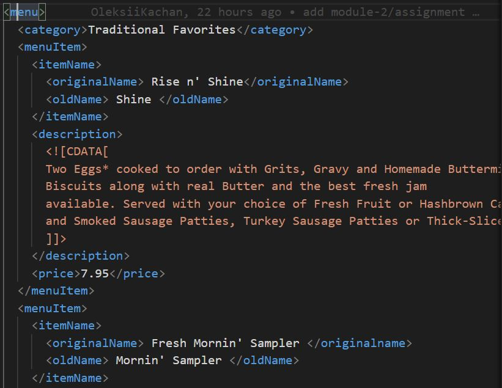
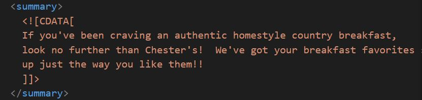
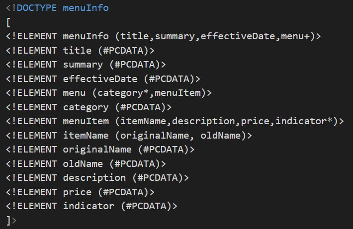
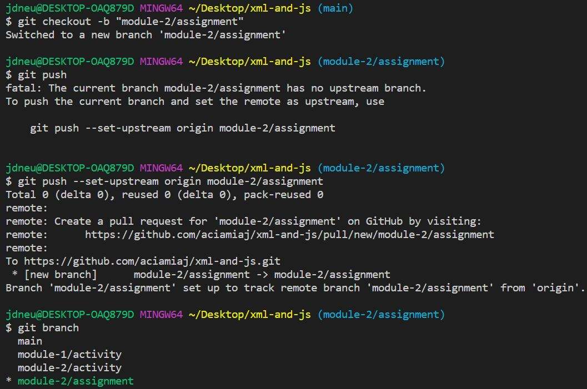

1. <effective Date>03/12/2016</effective Date>
    effective Date contains space in between, to fix this issue we can put it like this <effectiveDate>03/12/2016</effectiveDate>

    

    <originalName> Fresh Mornin' Sampler </originalname>
    The closing tag is different from the opening tag <originalName>, to fix this issue, it should be closed with the same format 
    </originalName> 

    

    <name> Oatmeal Breakfast </originalName>
    The element type "name" must be terminated by the matching end-tag </name> or name canbe changed to originalName

    

    There is missing opening and closing tag for <menu></menu>

    There is missing category tag.

    

    There is missing indicator tag.

    

 2. CDATA is used in this document because there is data in         between strings which could be interpreted as XML markup as shown on one CDATA below. 

     

 3. Answer is in assignment_Jaimaica.xml
     
    
 4. Prolog is <?xml version="1.0" encoding="UTF-8" standalone="yes" ?>
    Document Body is all the data from opening tag to <menuInfo> to closing tag </menuInfo>
    Epilog is <!--Jaimaica N01516797-->
    There is no processing instruction in the document.

5.  Answer is in assignment_Jaimaica.xml
    

6.  Validated no errors found
    
7.  