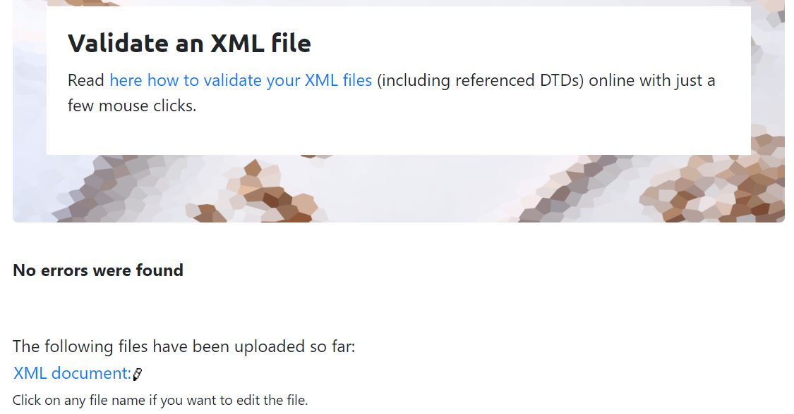
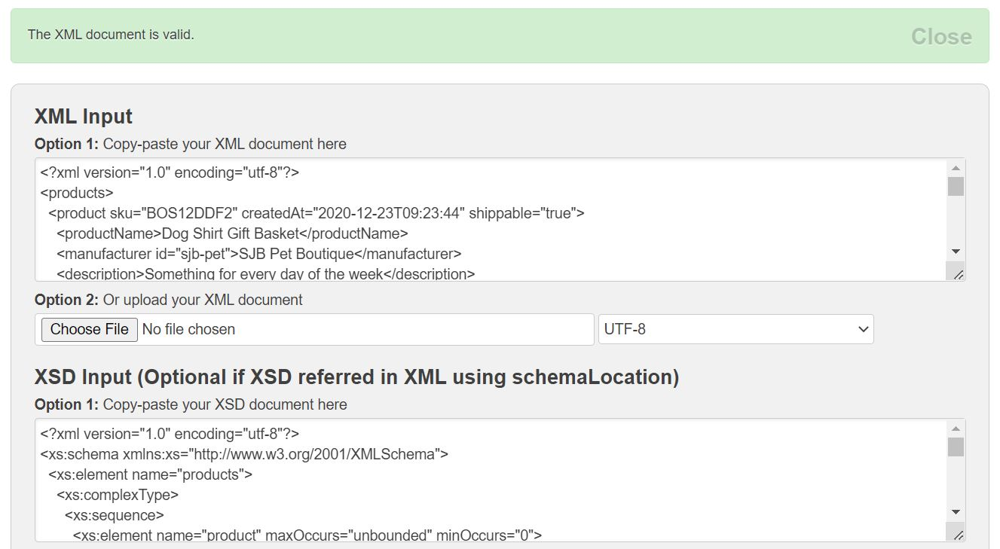

# Assignment

1. Open `module-3/assignments/assignment.xml` in your editor
2. Create DTD for this file and validate it using any of the tools we used
3. Create XSD for this file and validate it using any of the tools we used
4. Explain your thought process for these 2 declarations

Create `module-3/assignments/assignment_YOURNAME.md` and add your theory answers. Add screenshots of each step to the file.

2. 
3. 
4. DTD declarations are somewhat quite difficult to understand for non technical users while XSD is somewhat straightforward and user friendly. Though, same that requires understanding and researching especially for creating it and got some errors. Need to practice to get used to it.